# Operarionalizing Machine Learning in Azure ML Studio

This project aims to demonstrate how to train a model using Azure Machine Learning Studio and put it in production to an end user. The dataset used was Banking Marketing dataset, where the goal is to predict whether a client would sign a bank term deposit based on several features. The training process was made entirely using Auto ML through Azure Machine Learning Studio. After that, it was chosen the best model to accordingly to the best algorithm, VotingEnsemble, and deployed into production. With the deployed model, it was enabled the Application Insight using Azure Python SDK. For the documentation, it was used Swagger instance running with the documentation for the HTTP API of the model. The model was consumed using the deployed scoring URI and key authentication running the endpoint.py script against the API producing JSON output from the model. I was used Apache Benchmark to retrieve the performance result details running against the HTTP API. Finally, it was created, deployed and consumed a pipeline. The model and the pipeline can be accessed through REST terminals.

## Architectural Diagram

The following steps were performed in order to complete this project:

* Authentication
* Automated ML Experiment
* Deploy the best model
* Enable logging
* Swagger Documentation
* Consume model endpoints
* Create and publish a pipeline
* Documentation

## Key Steps
* Registered the Bank Markerting dataset. It was used the provided url to the csv dataset and uploaded to Azure ML Studio.    
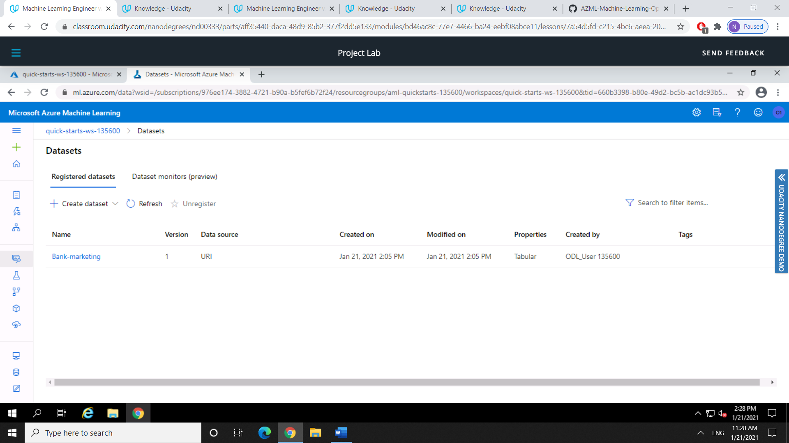

* Completed the experiment. It was created a cluster using Standard_DS12_v2 for the Virtual Machine and 1 as the minimum number of nodes. The experimente was ran with target column 'y' to predict if the person would sign the bank term deposit using classification without enable Deep Learning.      
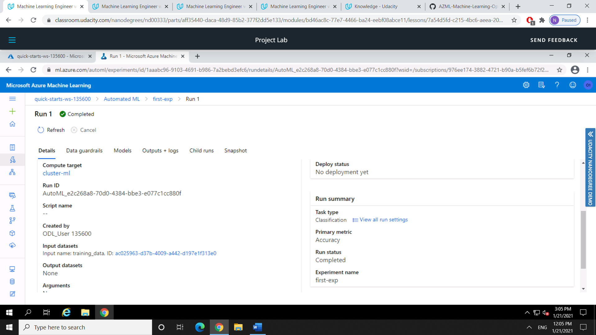

* Best model obtained by auto ML. In the AutoML section the VotingEnsemble resulted in the best accuracy. This model was deployed using the _Azure Container Instance_.      
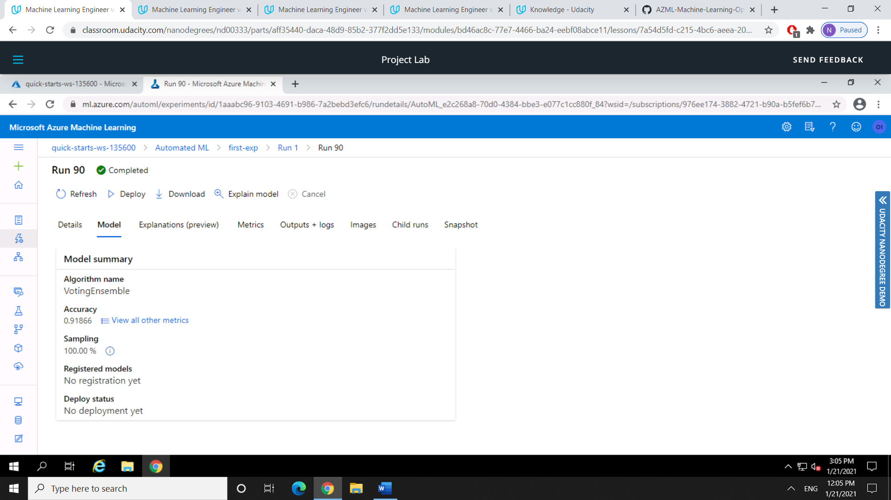

* Logs.py were ran obtaining the logs. It was used the Azure Python SDK for this task.       
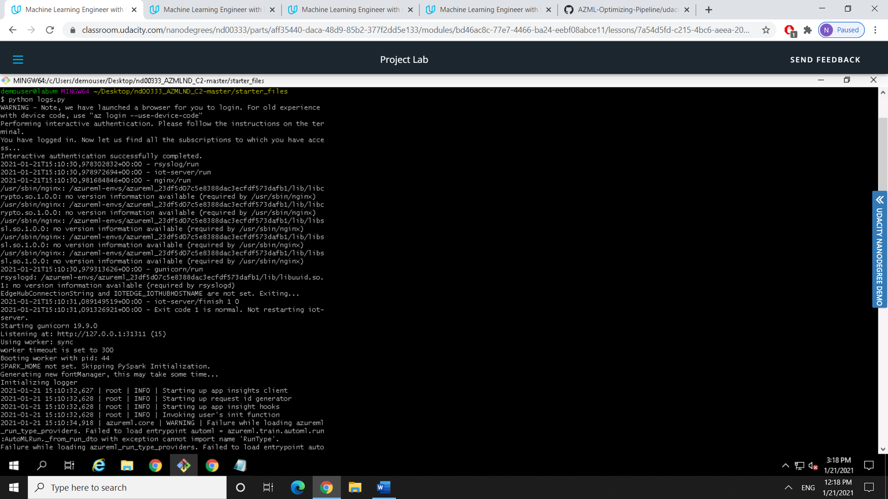

* The Application Insights was enabled when running the logs.py.    
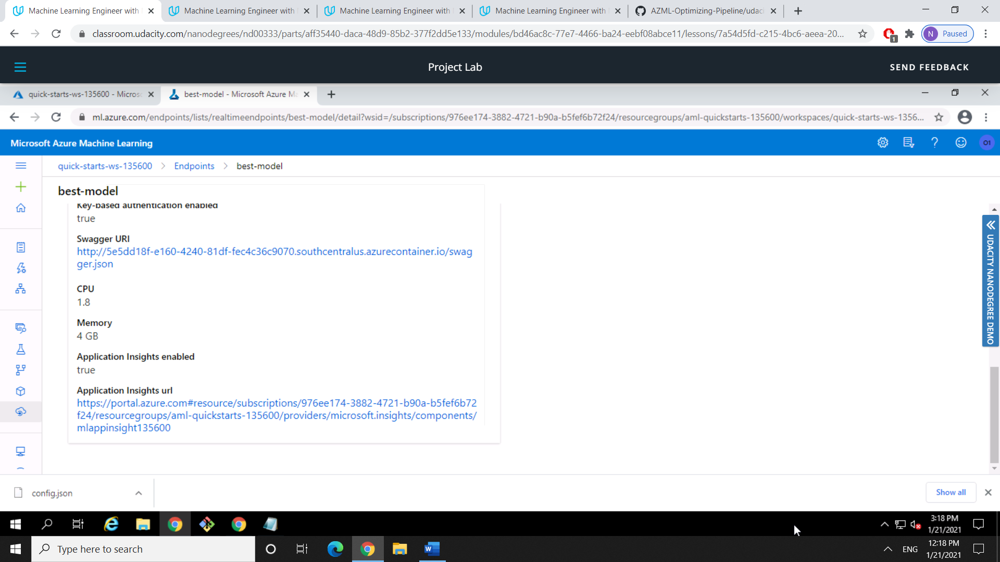

* It was downloaded swagger.json file provided in the Endpoints section of Azure ML Studio. It was ran the swagger.sh and serve.py files to be able to interact with the swagger instance running with the documentation for the HTTP API of the model.     
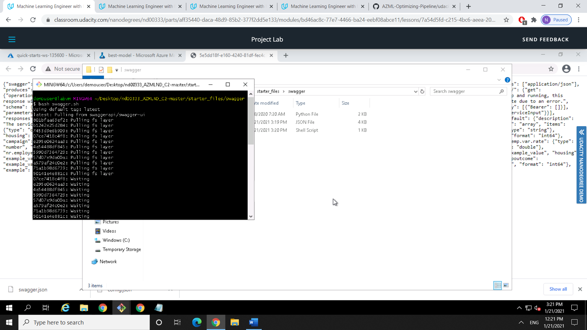

* Methods and responses from Swagger used to interact with the model.    
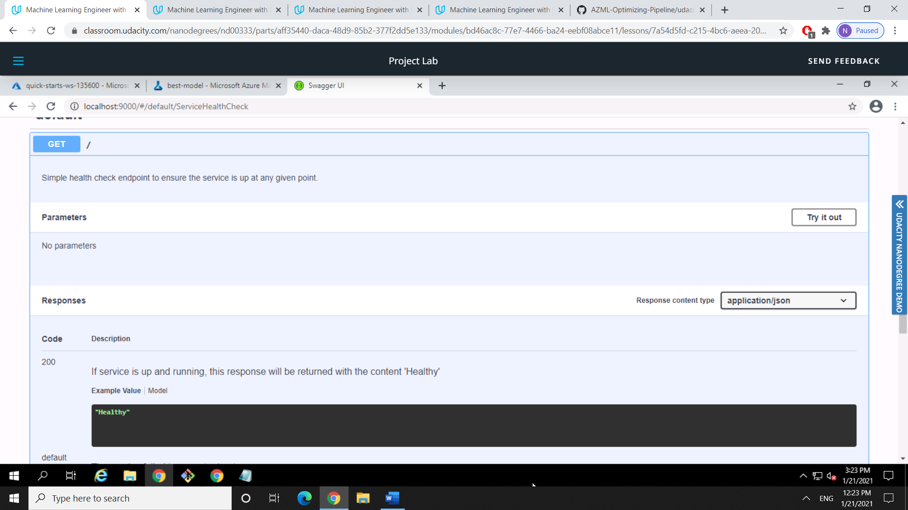

  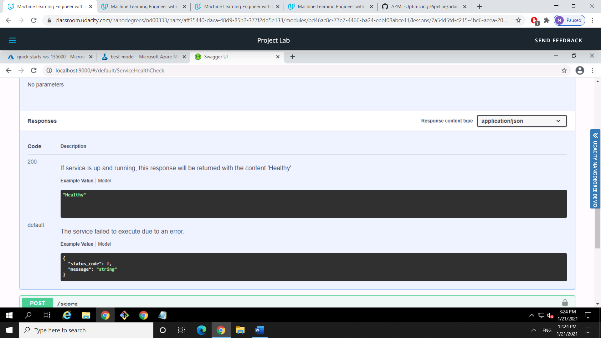

  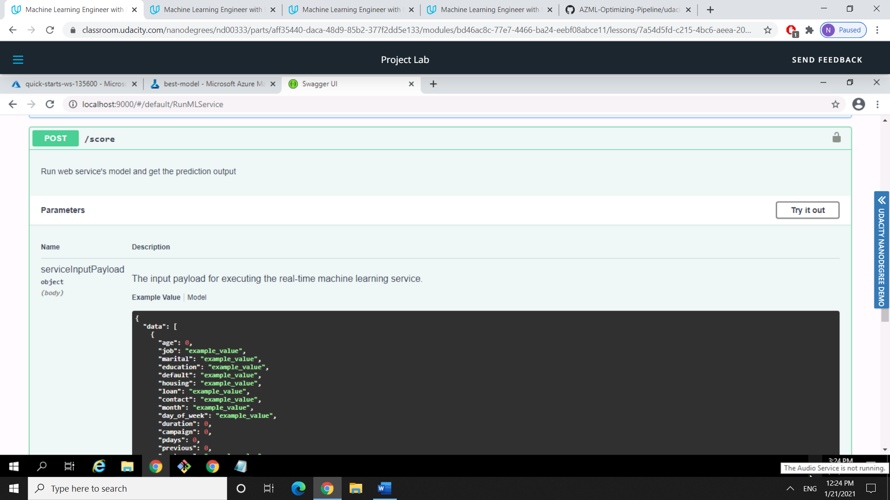

  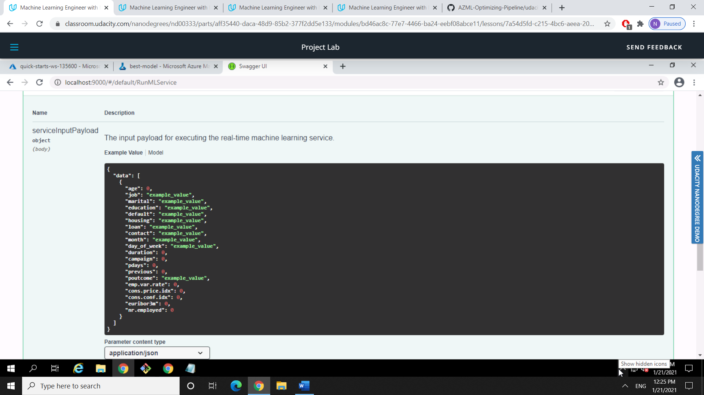

  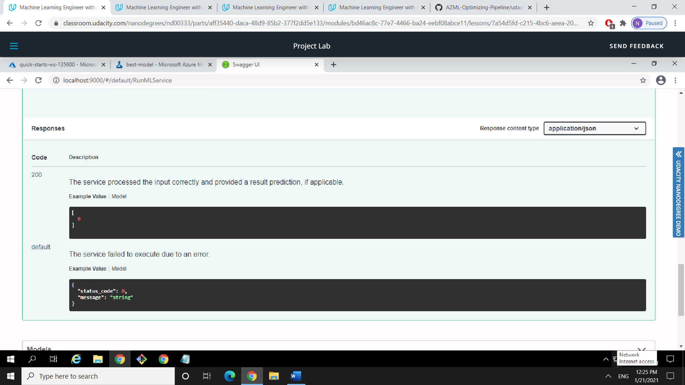

* Ran the endpoint.py against the API to inference a prediction from the deployed model.    
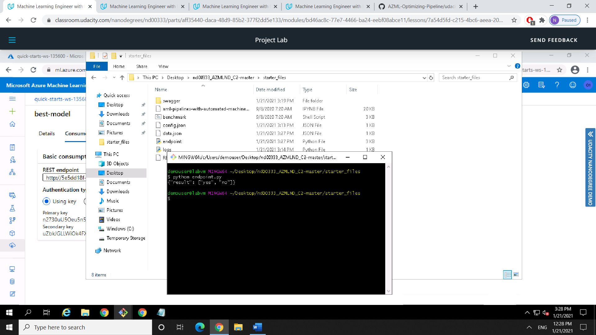

* Ran Apache Benchmark against the HTTP API to retrieve the performance result details.    
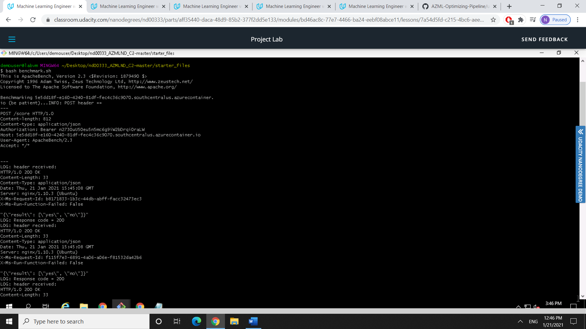

* The Pipeline has been created. It was used the aml-pipelines-with-automated-machine-learning-step Jupyter Notebook to create a Pipeline.    
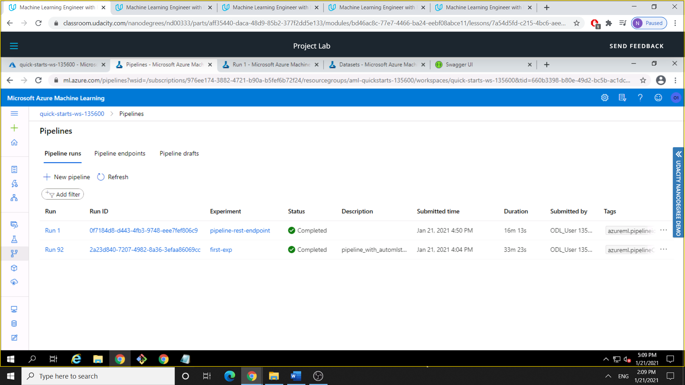

* The Pipeline endpoint was available after deploy it.    
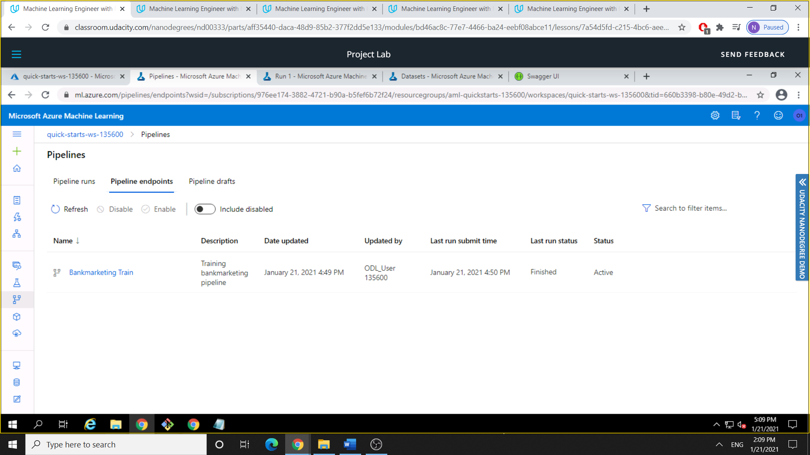

* The Published Pipeline overview shows the REST endpoint and the ACTIVE status.    
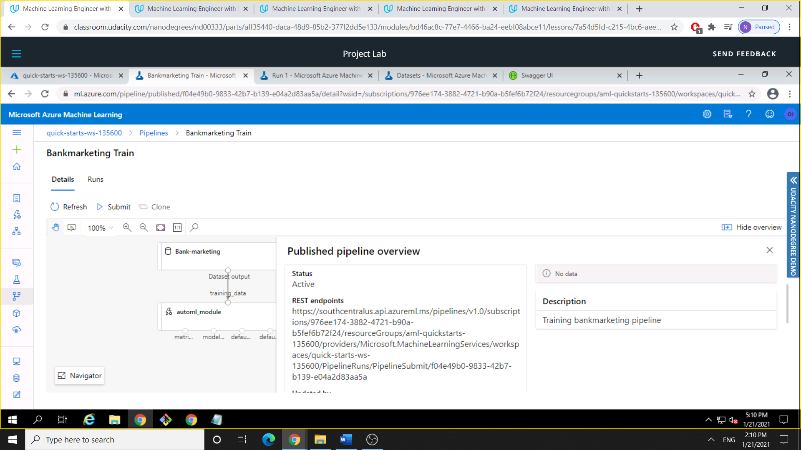

* The RunDetails Widget shows the step runs.    
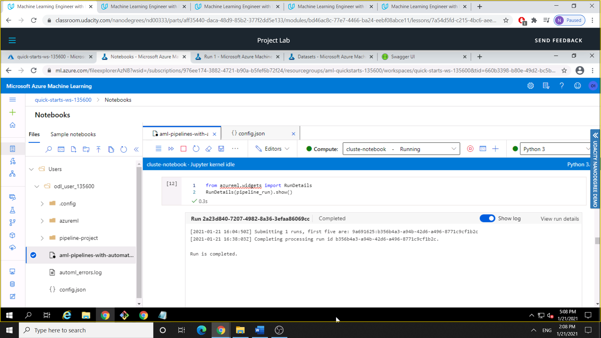

* ML Studio showing the scheduled run.    
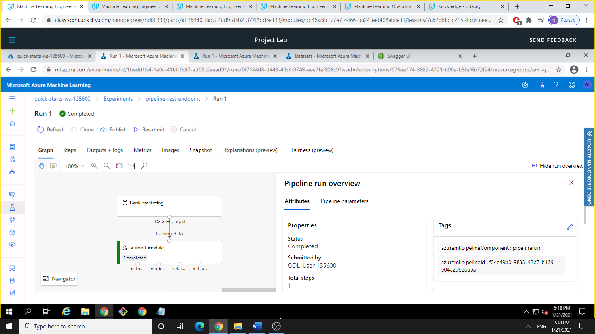

## Screen Recording
The following link shows a screen recording of the project in action. The screencast demonstrates:
* Working deployed ML model endpoint
* Deployed Pipeline
* Available AutoML Model
* Successful API requests to the endpoint with a JSON payload

https://www.youtube.com/watch?v=MrXGluUcm9c&ab_channel=N%C3%ADcolasWeisdeSouzaPauli

## Future improvements
Different techniques can be used to improve the model performance among them include feature engineering, feature selection, ensemble methods, algorithm tunning and cross-validation. In this dataset case, more samples could be added to improve the learning process of the algorithm to retain more patterns. The dataset presented class imbalance, solving this problem would result in a better accuracy. The training time was also limited, so with more training time the model could capture other different patterns. 
